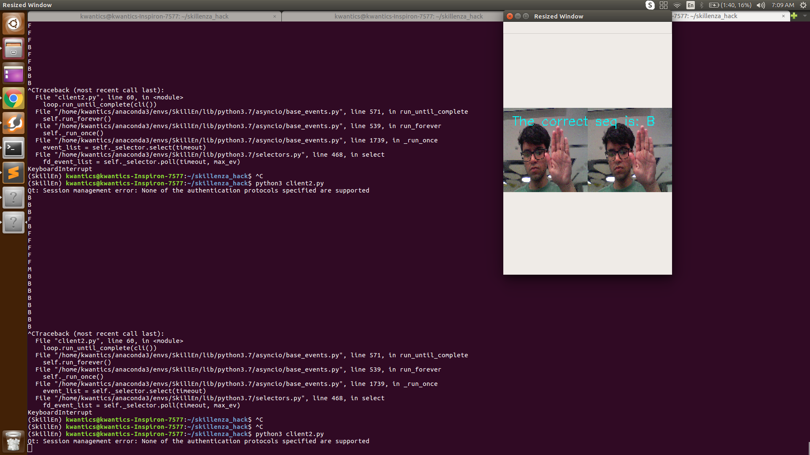

# Team
## Disassbler

# Video chat for speech impariant people
	
	An application which felicitates video conferencing between people who speak sign
	language and people who do not undestand.

	Uisng deeplearning model convert the sign laguage to text which is further converted to
	speech using Azure text to speech api.

# Working screen shots

## prizes enrolled for 

### Hacknight4

## Project Field
### App Service
### Azure Cognitive services

## Tech used
### Sockets 
### Convolution Neural Networks
### openCv
### asyncio
### cognitive servicies (text to speech)

